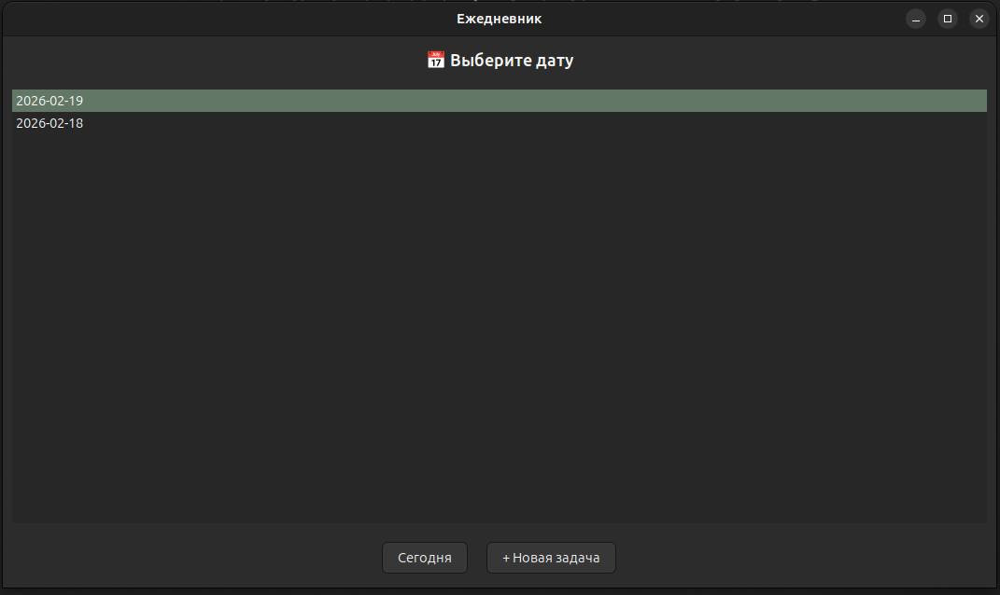
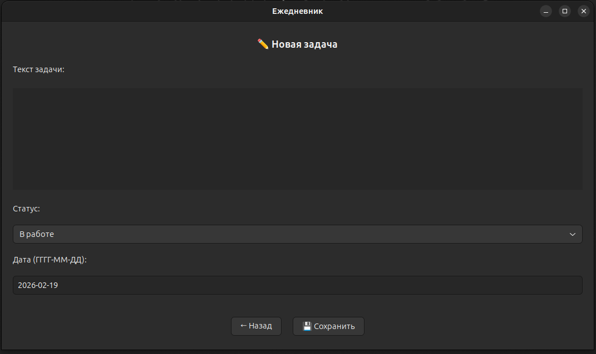

# GTK Reporter — Ежедневник для ведения задач

Приложение на Rust + GTK для управления ежедневными задачами. Позволяет создавать, редактировать и удалять задачи, группировать их по статусам и датам, а также формировать отчёты.

## Возможности

- 📅 **Просмотр задач по дате** — список всех дат с задачами, быстрый переход к сегодняшнему дню
- ✅ **Управление статусами** — три статуса задачи:
  - В работе
  - Отдал в тестирование
  - Готово
- ✏️ **Редактирование задач** — изменение текста, статуса и даты задачи
- 🗑️ **Удаление задач** — удаление ненужных задач
- 📋 **Копирование отчёта** — формирование структурированного отчёта за день с группировкой по статусам и копированием в буфер обмена
- 💾 **Автосохранение** — все данные сохраняются в файл `~/.gtk-reporter/gtk-reporter.json`

## Скриншоты

### Главный экран — список дат


### Экран задач на выбранную дату


## Установка

### Требования

- Rust (последняя стабильная версия)
- GTK 3.24+
- Linux (протестировано), также должно работать на Windows и macOS

### Сборка

```bash
git clone <repository-url>
cd gtk-reporter
cargo build --release
```

### Запуск

```bash
cargo run --release
```

Или запустить скомпилированный бинарник:

```bash
./target/release/gtk-reporter
```

## Использование

### Создание задачи

1. Нажмите кнопку **"+ Новая задача"** на главном экране или **"+ Добавить"** на экране задач
2. Введите текст задачи
3. Выберите статус (по умолчанию "В работе")
4. Укажите дату в формате ГГГГ-ММ-ДД
5. Нажмите **"💾 Сохранить"**

### Редактирование задачи

1. Откройте нужную дату (двойной клик по дате на главном экране)
2. Двойной клик по задаче для редактирования
3. Измените текст, статус или дату
4. Нажмите **"💾 Сохранить"**

### Удаление задачи

1. Откройте задачу на редактирование (двойной клик)
2. Нажмите **"🗑️ Удалить"**
3. Подтвердите удаление

### Копирование отчёта

1. Откройте нужную дату
2. Нажмите **"📋 Копировать отчет"**
3. Отчёт будет скопирован в буфер обмена в формате:

```
Отчет 2026-02-19

=== В работе ===
• Задача 1
• Задача 2

=== Отдал в тестирование ===
• Задача 3

=== Готово ===
• Задача 4
```

## Структура данных

Данные хранятся в JSON-файле `~/.gtk-reporter/gtk-reporter.json`:

```json
{
  "max_id": 5,
  "rows": {
    "2026-02-19": [
      {
        "id": 1,
        "text": "Текст задачи",
        "status": "Working"
      }
    ]
  },
  "cur_date": "2026-02-19"
}
```

## Зависимости

- `gtk = "0.18.1"` — GUI фреймворк
- `glib = "0.18"` — базовые типы GLib
- `serde` + `serde_json` — сериализация JSON
- `chrono = "0.4.43"` — работа с датой и временем
- `dirs = "5.0"` — определение домашнего каталога
- `pango = "0.18"` — работа с текстом
- `thiserror = "2.0.17"` — обработка ошибок

## Лицензия

См. файл [LICENSE](LICENSE).
